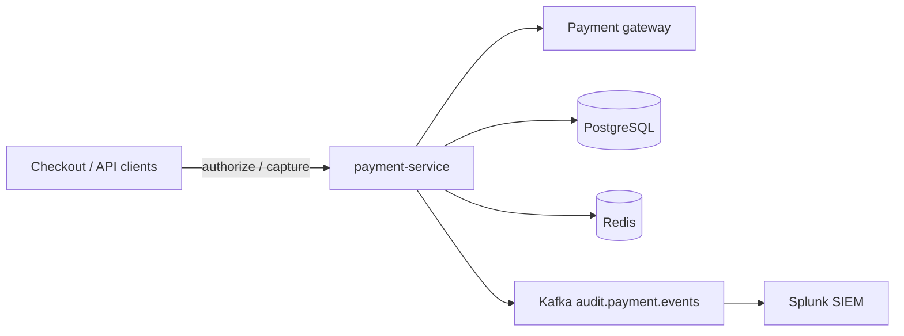

# PortIOPay Payment Service

Core payment processing microservice for **PortIOPay**. Handles payment authorization and capture, per-merchant rate limiting, PCI-DSS audit event publishing, and nightly settlement reconciliation.

| | |
|---|---|
| **Artifact** | `io.portioapay:payment-service` |
| **Version** | 2.4.1 |
| **Runtime** | Java 17 |
| **HTTP port** | 8080 (default) |
| **Criticality** | Tier 1 — all PortIOPay checkout flows depend on this service |

## Table of contents

- [Overview](#overview)
- [Tech stack](#tech-stack)
- [Repository layout](#repository-layout)
- [Prerequisites](#prerequisites)
- [Configuration](#configuration)
- [Running locally](#running-locally)
- [API reference](#api-reference)
- [Architecture](#architecture)
- [Observability](#observability)
- [CI/CD](#cicd)
- [Deployment](#deployment)
- [Ownership](#ownership)

## Overview

The payment service sits on the critical path for PortIOPay transactions. It:

- **Authorizes** payments via an external gateway (wrapped with Resilience4j circuit breaker and exponential backoff retry).
- **Captures** previously authorized funds.
- **Rate-limits** requests per merchant using Redis, with higher limits for enterprise tiers.
- **Emits audit events** to Kafka for PCI DSS 4.0 compliance (Splunk SIEM downstream).
- **Runs nightly reconciliation** at 02:30 UTC against settlement files.

Production targets ~2M transactions/day with a P99 latency SLA under 500ms.

## Tech stack

| Layer | Technology |
|-------|------------|
| Language | Java 17 |
| Framework | Spring Boot 3.2 (`spring-boot-starter-web`, JPA, Actuator) |
| Resilience | Resilience4j 2.1 (circuit breaker + retry on gateway calls) |
| Database | PostgreSQL (JPA/Hibernate, `ddl-auto: validate`) |
| Cache / rate limiting | Redis (`RedisTemplate`) |
| Messaging | Apache Kafka (audit event producer) |
| Build | Maven (`pom.xml`) |

## Repository layout

```
payment-service/
├── .github/workflows/ci.yml    # Test, build, OWASP dependency check
├── CODEOWNERS                  # Review routing by path
├── pom.xml                     # Maven build and dependencies
├── src/main/java/io/portioapay/payment/
│   ├── PaymentServiceApplication.java
│   ├── controller/PaymentController.java
│   ├── model/                    # PaymentRequest, Transaction (JPA entity)
│   └── service/
│       ├── PaymentGatewayService.java   # Gateway + resilience
│       ├── RateLimiterService.java      # Per-merchant token bucket
│       ├── AuditLogService.java         # Kafka audit events
│       └── ReconciliationService.java   # Scheduled reconciliation job
└── src/main/resources/application.yml
```

## Prerequisites

- **JDK 17** (Temurin recommended)
- **Maven 3.9+**
- Running instances of:
  - **PostgreSQL 15** — database `portioapay_payments` (or override via `DB_URL`)
  - **Redis 7** — rate limiter counters
  - **Kafka** — audit topic `audit.payment.events`

CI uses the same stack via GitHub Actions service containers (see [CI/CD](#cicd)).

## Configuration

Configuration is driven by `src/main/resources/application.yml` and environment variables.

| Variable | Default | Description |
|----------|---------|-------------|
| `DB_URL` | `jdbc:postgresql://localhost:5432/portioapay_payments` | PostgreSQL JDBC URL |
| `DB_USER` | `payments` | Database username |
| `DB_PASSWORD` | *(empty)* | Database password |
| `REDIS_HOST` | `localhost` | Redis hostname |
| `REDIS_PORT` | `6379` | Redis port |
| `KAFKA_BROKERS` | `localhost:9092` | Kafka bootstrap servers |
| `ENVIRONMENT` | `unknown` | Injected into audit log entries (e.g. `local`, `staging`, `production`) |

**Resilience4j** (gateway instance `paymentGateway`) is configured in `application.yml`:

- Circuit breaker: 10-call sliding window, 50% failure threshold, 30s open state
- Retry: max 3 attempts, 500ms base wait, exponential backoff ×2

For local overrides, use `application-local.yml` or `application-secrets.yml` (both are gitignored).

## Running locally

1. Start PostgreSQL, Redis, and Kafka (any local setup — Docker, Colima, etc.).

2. Create the database and ensure the `transactions` table schema matches the `Transaction` JPA entity (`ddl-auto: validate` will fail if the schema is missing).

3. Build and run:

```bash
mvn clean package -DskipTests
mvn spring-boot:run
```

Or run the packaged JAR:

```bash
java -jar target/payment-service-2.4.1.jar
```

4. Verify health:

```bash
curl http://localhost:8080/actuator/health
```

### Example: authorize a payment

```bash
curl -s -X POST http://localhost:8080/api/v1/payments/authorize \
  -H "Content-Type: application/json" \
  -H "X-Merchant-Tier: standard" \
  -d '{
    "merchantId": "merch_123",
    "idempotencyKey": "idem_abc_001",
    "amount": 49.99,
    "currency": "USD",
    "paymentMethodToken": "pm_tok_xyz"
  }'
```

**Success (200):**

```json
{
  "transactionId": "idem_abc_001",
  "gatewayTransactionId": "gtw_idem_abc_001",
  "status": "AUTHORIZED"
}
```

**Rate limited (429):**

```json
{
  "error": "rate_limit_exceeded",
  "message": "Too many requests. Retry after 1 second."
}
```

### Example: capture funds

```bash
curl -s -X POST "http://localhost:8080/api/v1/payments/capture?gatewayTransactionId=gtw_idem_abc_001&amount=49.99" \
  -H "X-Merchant-Id: merch_123"
```

## API reference

Base path: `/api/v1/payments`

| Method | Path | Headers | Description |
|--------|------|---------|-------------|
| `POST` | `/authorize` | `X-Merchant-Tier` (required) | Authorize a payment; body is `PaymentRequest` JSON |
| `POST` | `/capture` | `X-Merchant-Id` (required) | Capture funds; query params: `gatewayTransactionId`, `amount` |

### `PaymentRequest` body (authorize)

| Field | Required | Notes |
|-------|----------|-------|
| `merchantId` | Yes | Merchant identifier |
| `idempotencyKey` | Yes | Unique key for idempotent authorization |
| `amount` | Yes | Positive decimal |
| `currency` | Yes | ISO currency code |
| `paymentMethodToken` | Yes | Tokenized payment method (no raw PAN in API) |
| `customerId` | No | Optional customer reference |
| `description` | No | Optional description |
| `metadata` | No | Optional opaque metadata |

### Actuator endpoints

Exposed under `/actuator` (see `management.endpoints.web.exposure.include`):

| Endpoint | Purpose |
|----------|---------|
| `/actuator/health` | Liveness/readiness |
| `/actuator/info` | Build info |
| `/actuator/metrics` | Micrometer metrics |
| `/actuator/prometheus` | Prometheus scrape target |

## Architecture



**Authorize flow**

1. `RateLimiterService` checks per-merchant counters in Redis (100 req/s standard, 1000 req/s enterprise, 3× burst).
2. `PaymentGatewayService.authorize` calls the gateway with circuit breaker + retry.
3. `AuditLogService` publishes `PAYMENT_AUTHORIZED` to Kafka (sensitive fields masked; local fallback log if Kafka is down).

**Capture flow**

1. Gateway capture with same resilience policies.
2. Audit event `PAYMENT_CAPTURED` published.

**Reconciliation**

- `ReconciliationService` runs on cron `0 30 2 * * *` (UTC).
- Processes a 26-hour window (24h + 2h buffer for late settlement files).

## Observability

- Structured logs via SLF4J (`@Slf4j` on services and controller).
- Prometheus metrics via Spring Boot Actuator.
- Audit trail on Kafka topic `audit.payment.events` (13-month retention per topic policy).

On-call: PagerDuty service **`portioapay-payments-prod`**.

## CI/CD

GitHub Actions workflow **CI** (`.github/workflows/ci.yml`):

- Triggers on push to `main` / `develop` and on PRs to `main`.
- **test** job: Postgres 15 + Redis 7 service containers, `mvn test`, then `mvn package -DskipTests`.
- **security-scan** job: OWASP Dependency-Check via Maven plugin.

```bash
# Run the same checks locally
mvn test
mvn package -DskipTests
mvn org.owasp:dependency-check-maven:check
```

## Deployment

The service is deployed to **Amazon EKS** (Kubernetes). Internal DNS:

| Environment | Endpoint |
|-------------|----------|
| Production | `payment-service.portioapay.internal:8080` |
| Staging | `payment-service.staging.portioapay.internal:8080` |

Helm charts and infra manifests live in the platform repository (not in this repo). Deployments are promoted through the standard PortIOPay release pipeline after CI passes on `main`.

## Ownership

| Area | GitHub team |
|------|-------------|
| Default review | `@payments-team` |
| `src/.../service/` (core payment logic) | `@checkout-leads`, `@payments-team` |
| Reconciliation & audit services | `@finance-eng`, `@payments-team` |
| `.github/` workflows | `@payments-team` |

See [`CODEOWNERS`](./CODEOWNERS) for path-specific rules. Merges require code owner approval per org policy.

**Team:** PortIOPay Payments
