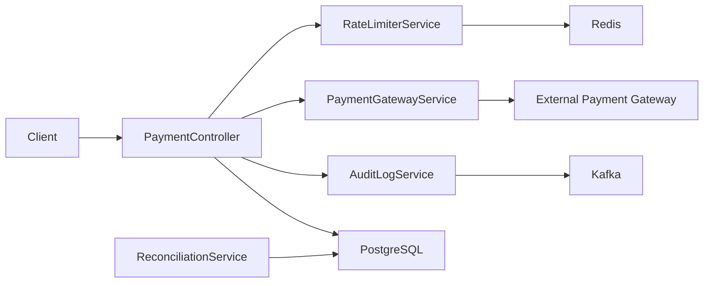

# PortIOPay Payment Service

Core payment processing service for [PortIOPay](https://github.com/portio-pay-demo/payment-service). Authorizes and captures card payments, enforces per-merchant rate limits, emits PCI-DSS audit events, and runs nightly settlement reconciliation.

| | |
|---|---|
| **Language** | Java 17 |
| **Framework** | Spring Boot 3.2 |
| **Version** | 2.4.1 (`pom.xml`) |
| **Default port** | `8080` |
| **Team** | PortIOPay Payments |

## Overview

The payment-service sits on the Tier 1 critical path for PortIOPay. It wraps the external payment gateway with resilience patterns (circuit breaker, exponential backoff retries), applies token-bucket rate limiting per merchant tier via Redis, persists transaction state in PostgreSQL, and ships tamper-evident audit records to Kafka for Splunk SIEM ingestion.

Production targets roughly 2M transactions/day with a P99 latency SLA under 500ms.

### Responsibilities

- **Authorization** — Reserve funds against a payment method token (idempotent via `idempotencyKey`).
- **Capture** — Settle a previously authorized gateway transaction.
- **Rate limiting** — Per-merchant token bucket with higher limits for enterprise tiers.
- **Audit logging** — PCI DSS 4.0–aligned events on topic `audit.payment.events`.
- **Reconciliation** — Scheduled job at 02:30 UTC comparing settled transactions to provider files.



## Tech stack

| Layer | Technology |
|-------|------------|
| Runtime | Java 17 |
| API | Spring Web, Jakarta Validation |
| Persistence | Spring Data JPA, PostgreSQL |
| Cache / rate limits | Spring Data Redis |
| Messaging | Spring Kafka |
| Resilience | Resilience4j (circuit breaker, retry) |
| Observability | Spring Boot Actuator, Prometheus metrics |
| Build | Maven |

## Repository structure

```
payment-service/
├── .github/workflows/ci.yml   # CI: tests, build, OWASP dependency check
├── CODEOWNERS                 # Review routing by path
├── pom.xml
├── src/main/java/io/portioapay/payment/
│   ├── PaymentServiceApplication.java
│   ├── controller/PaymentController.java
│   ├── model/                   # PaymentRequest, Transaction entity
│   └── service/                 # Gateway, rate limiter, audit, reconciliation
└── src/main/resources/application.yml
```

## Prerequisites

- **JDK 17** (Temurin recommended)
- **Maven 3.9+**
- Running instances of:
  - **PostgreSQL 15** — database `portioapay_payments`
  - **Redis 7** — rate limit counters
  - **Kafka** — audit event publishing (optional for local smoke tests if audit failures are acceptable)

Quick local dependencies with Docker:

```bash
docker run -d --name pay-pg -p 5432:5432 \
  -e POSTGRES_DB=portioapay_payments \
  -e POSTGRES_USER=payments \
  -e POSTGRES_PASSWORD=localdev \
  postgres:15

docker run -d --name pay-redis -p 6379:6379 redis:7

docker run -d --name pay-kafka -p 9092:9092 \
  -e KAFKA_CFG_NODE_ID=0 \
  -e KAFKA_CFG_PROCESS_ROLES=controller,broker \
  -e KAFKA_CFG_LISTENERS=PLAINTEXT://:9092,CONTROLLER://:9093 \
  -e KAFKA_CFG_LISTENER_SECURITY_PROTOCOL_MAP=CONTROLLER:PLAINTEXT,PLAINTEXT:PLAINTEXT \
  -e KAFKA_CFG_CONTROLLER_QUORUM_VOTERS=0@kafka:9093 \
  -e KAFKA_CFG_CONTROLLER_LISTENER_NAMES=CONTROLLER \
  bitnami/kafka:3.6
```

Adjust image names/ports to match your environment if you use an existing shared dev stack.

## Environment variables

Configuration is in `src/main/resources/application.yml`. Override via environment variables or Spring properties:

| Variable | Default | Description |
|----------|---------|-------------|
| `DB_URL` | `jdbc:postgresql://localhost:5432/portioapay_payments` | JDBC URL for PostgreSQL |
| `DB_USER` | `payments` | Database username |
| `DB_PASSWORD` | *(empty)* | Database password |
| `REDIS_HOST` | `localhost` | Redis hostname |
| `REDIS_PORT` | `6379` | Redis port |
| `KAFKA_BROKERS` | `localhost:9092` | Kafka bootstrap servers |
| `ENVIRONMENT` | `unknown` | Injected into audit log entries (e.g. `local`, `staging`, `production`) |

Spring also honors standard overrides, e.g. `SERVER_PORT`, `SPRING_PROFILES_ACTIVE`.

**Secrets:** Do not commit credentials. Use your platform secret store in deployed environments. Local overrides can go in `application-local.yml` (gitignored).

## Run locally

1. Start PostgreSQL, Redis, and Kafka (see above).
2. Ensure the `transactions` table schema matches the JPA entity (`ddl-auto: validate` — migrations are managed outside this repo in production).
3. Build and run:

```bash
mvn spring-boot:run
```

With explicit env vars:

```bash
export DB_PASSWORD=localdev
export ENVIRONMENT=local
mvn spring-boot:run
```

Verify health:

```bash
curl -s http://localhost:8080/actuator/health | jq .
```

### Build and test

```bash
mvn test
mvn package -DskipTests
```

CI (`.github/workflows/ci.yml`) runs tests against service containers for Postgres and Redis with:

```bash
DB_URL=jdbc:postgresql://localhost:5432/portioapay_payments_test
DB_USER=payments
DB_PASSWORD=test
```

## API

Base path: `/api/v1/payments`

### `POST /authorize`

Authorize a payment. Requires header `X-Merchant-Tier` (`enterprise` receives a higher rate limit).

**Request body** (`application/json`):

```json
{
  "merchantId": "merch_abc123",
  "idempotencyKey": "idem_unique_key_001",
  "amount": 49.99,
  "currency": "USD",
  "paymentMethodToken": "pm_tok_xxx",
  "customerId": "cust_001",
  "description": "Order #1001"
}
```

**Success (200):**

```json
{
  "transactionId": "idem_unique_key_001",
  "gatewayTransactionId": "gtw_idem_unique_key_001",
  "status": "AUTHORIZED"
}
```

**Rate limited (429):**

```json
{
  "error": "rate_limit_exceeded",
  "message": "Too many requests. Retry after 1 second."
}
```

### `POST /capture`

Capture funds for a prior authorization.

**Query parameters:**

| Parameter | Required | Description |
|-----------|----------|-------------|
| `gatewayTransactionId` | Yes | ID returned from authorize |
| `amount` | Yes | Amount to capture |

**Headers:**

| Header | Required | Description |
|--------|----------|-------------|
| `X-Merchant-Id` | Yes | Merchant identifier for audit logging |

**Success (200):**

```json
{
  "captureId": "gtw_idem_unique_key_001_captured",
  "status": "CAPTURED"
}
```

### Actuator endpoints

| Endpoint | Description |
|----------|-------------|
| `GET /actuator/health` | Liveness/readiness (details always shown) |
| `GET /actuator/info` | Application info |
| `GET /actuator/metrics` | Micrometer metrics |
| `GET /actuator/prometheus` | Prometheus scrape format |

> **Note:** Refund and transaction lookup endpoints are not implemented in this repository yet. The `Transaction` JPA entity supports statuses including `REFUNDED` for future work.

## Key implementation details

### Payment gateway (`PaymentGatewayService`)

- Resilience4j **circuit breaker** `paymentGateway`: 50% failure rate over 10 calls, 30s open state.
- **Retry** with exponential backoff: 3 attempts, 500ms base, multiplier 2.
- Gateway calls are currently **stubbed** (`gtw_<idempotencyKey>`); production deploys wire the real provider SDK.

### Rate limiting (`RateLimiterService`)

- Redis key `rate:{merchantId}` with 1-second TTL window.
- Default: 100 req/s, burst ×3; enterprise tier: 1000 req/s, burst ×3.

### Audit logging (`AuditLogService`)

- Publishes to Kafka topic `audit.payment.events`.
- Masks fields containing `card`, `cvv`, or `pan`.
- On Kafka failure, writes a structured fallback line to the application log.

### Reconciliation (`ReconciliationService`)

- Cron: `0 30 2 * * *` UTC.
- 26-hour lookback window (24h + 2h buffer for late settlement files).

## Deployment

The service is deployed to **Kubernetes on AWS EKS** by the PortIOPay platform team.

| Environment | Internal endpoint |
|-------------|-------------------|
| Production | `payment-service.portioapay.internal:8080` |
| Staging | `payment-service.staging.portioapay.internal:8080` |

Typical rollout flow:

1. Merge to `main` after CI passes (tests, JAR build, OWASP dependency check).
2. Platform pipeline builds a container image from `mvn package`.
3. Helm values (maintained in the platform `infra` repo) set env vars, replicas, and probes against `/actuator/health`.
4. Post-deploy: confirm Prometheus metrics and audit event volume in Splunk.

Contact **@payments-team** for Helm chart access and cluster credentials.

## Ownership and support

| | |
|---|---|
| **CODEOWNERS** | See [CODEOWNERS](./CODEOWNERS) — default `@payments-team`; checkout and finance paths need additional reviewers |
| **On-call** | PagerDuty `portioapay-payments-prod` |
| **Audit / compliance** | `@finance-eng` for `AuditLogService` and `ReconciliationService` |

## Related work

Open improvement branches in this org include gateway timeout backoff, token-bucket rate limiting, PCI audit logging, and connection pool tuning. See closed/merged PRs on the repository for history.

## License

Proprietary — PortIOPay / portio-pay-demo organization. Internal use only unless otherwise agreed.
